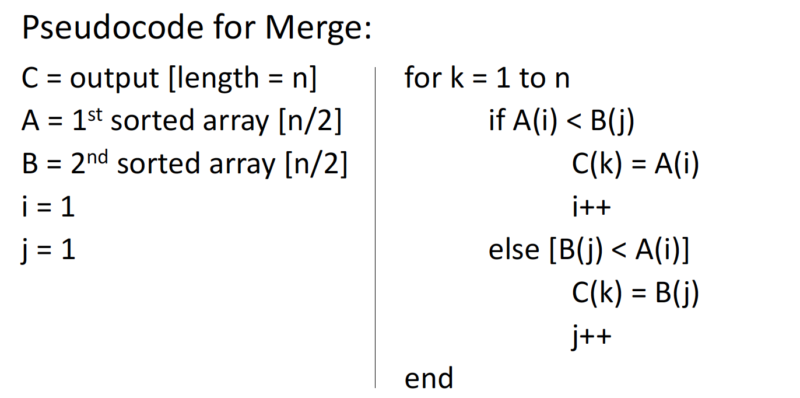
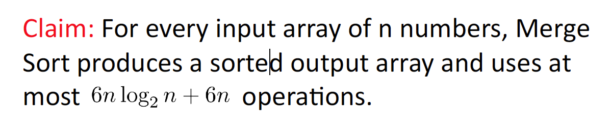
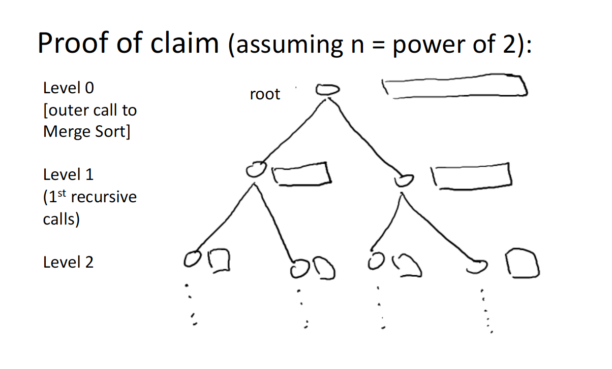
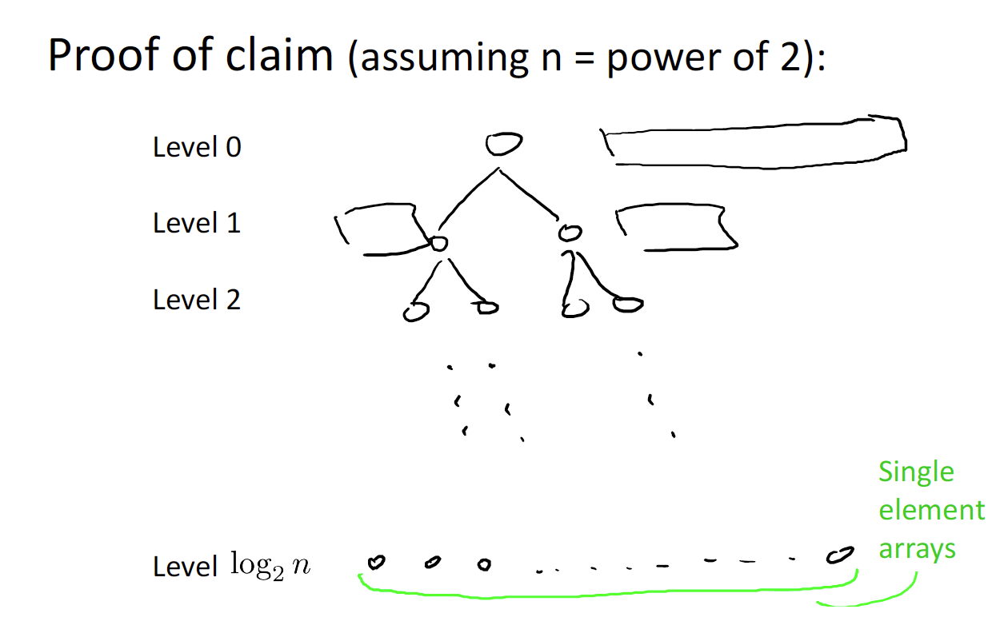
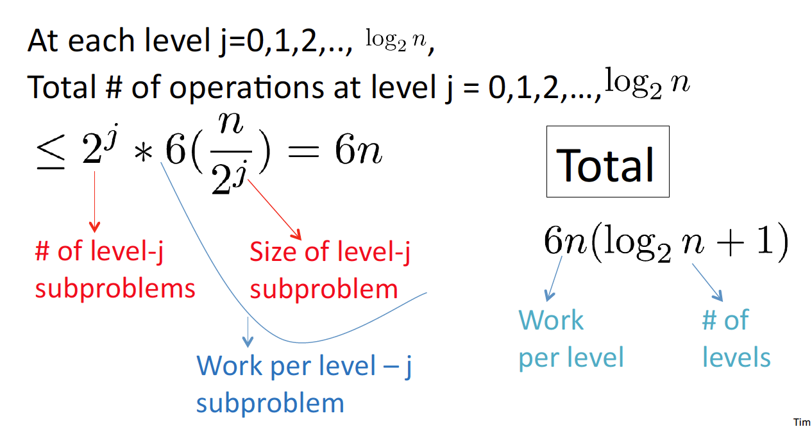

# The Sorting Problem

## Input

Array of n numbers unsorted (Assume distinct)

## Output

Same numbers,sorted in increasing order

# Merge Sort

## Example

## Pseudocode

[ignores base cases]

1. recursively sort 1st half of the input array

2. recursively sort 2nd half of the input array

3. merge two sorted sublists into one

### Merge

## Running Time

On array of N numbers:
running time -> # of lines of code executed

### Merge

running time of Merge on array of m numbers is <= _4m_ + 2 (_6m_ since _m_ >= 1)

### Overall

## Analysis

### Recursion Tree

write out all work done by recursive merge sort in a tree structure way

### Process

**how many levels**: logN (logN + 1 to be exact)

At each level j, there are **2^j** subproblems with each size of **n/(2^j)**

### Conclusion

