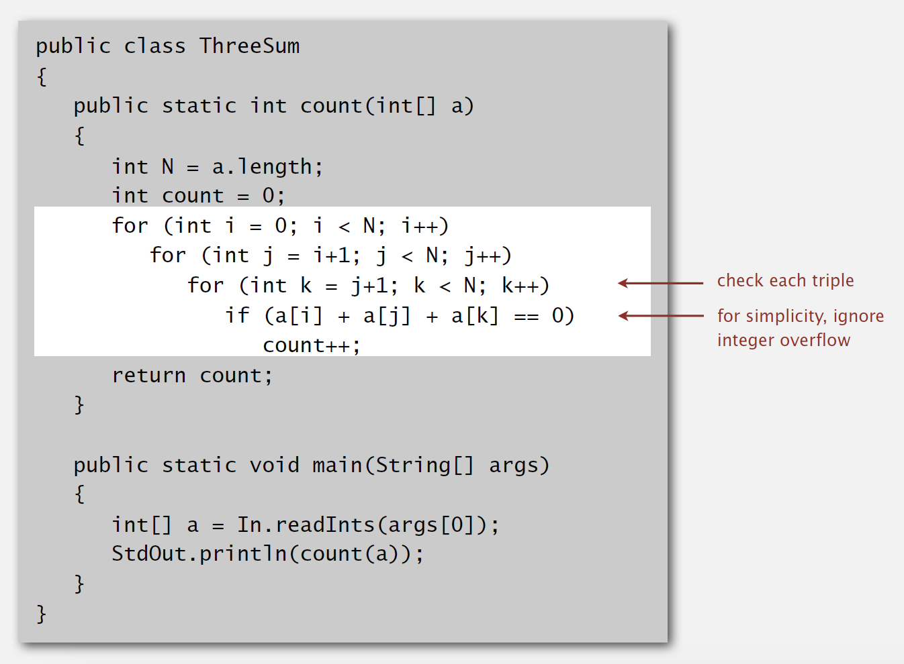

# Introduction

## Reasons to analyze algorithms

- Predict performance.
- Compare algorithms.
- Provide guarantees.
- Understand theoretical basis.

#### Primary practical reason

**Avoid performance bugs**

## Terms

- Quadratic

- Linearithmic

- Linear

## Scientific Method

A framework for predicting performance and comparing algorithms

### Method

- **Observe** some feature of the natural world
- **Hypothesize** a model that is consistent with the observations
- **Predict** events using the hypothesis
- **Verify** the predictions by making further observations
- **Validate** by repeating until the hypothesis and observations agree

### Principles

1. Experiments must be **reproducible**

2. Hypotheses must be **falsifiable**

# Observations

## Example: 3-SUM

Given N distinct integers, how many triples sum to exactly zero?

### Brute-force algorithm

