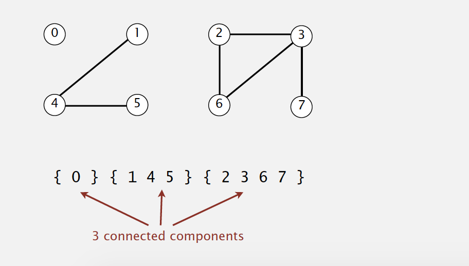
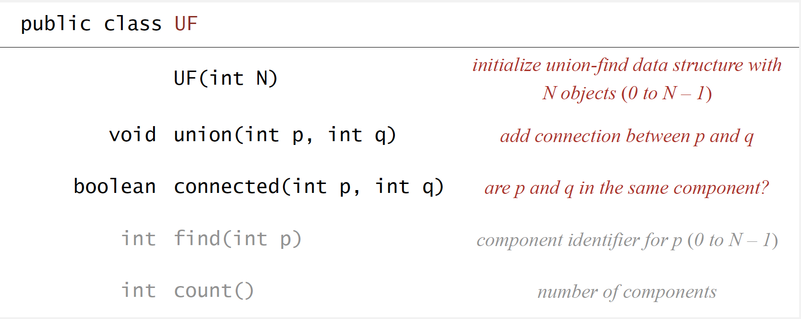

# Dynamic Connectivity

## Description

 

## Modeling

### Modeling the objects

Applications involve manipulating objects of all types:

- Pixels in a digital photo.
- Computers in a network.
- Friends in a social network.

  ...

When programming, convenient to name objects 0 to N –1.

- Use integers as array index

- Suppress details not relevant to union-find.

### Modeling the connections

We assume **is connected to** is an equivalence relation:

- Reflexive: p is connected to p.
- Symmetric: if p is connected to q, then q is connected to p.
- Transitive: if p is connected to q and q is connected to r, then p is connected to r.

**Connected components** - Maximal **set** of objects that are mutually
connected.

 

## Implementing the operations

### Find query.

Check if two objects are in the same component

### Union command

Replace components containing two objects with their union

 

## Union-find data type (API)

Design efficient data structure for union-find

- Number of objects _N_ can be huge.

- Number of operations _M_ can be huge.

- Find queries and union commands may be intermixed.

 

## Dynamic-connectivity client

Read in number of objects N from standard input.

Repeat

- read in pair of integers from standard input

- if they are not yet connected, connect them and print out pair

 

# Quick Find
